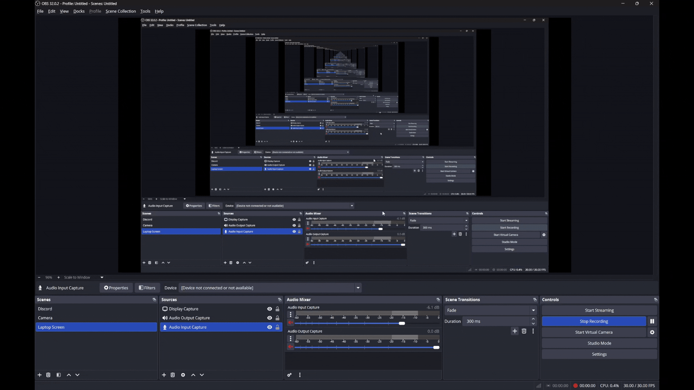
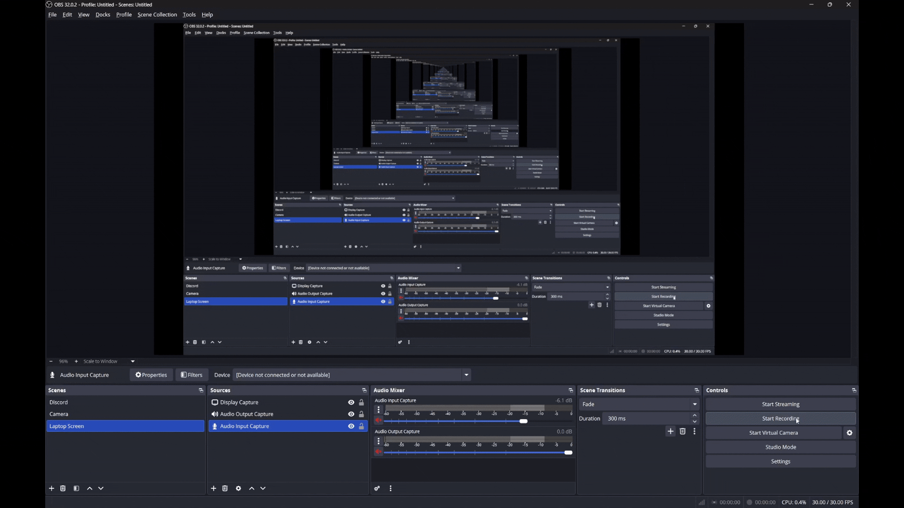

All the scrips are located in Assets/Scenes/Swamp/Scripts, or an other scene, depending on the task. I already deleted the scrips for the inventory display and random items array cause it wasn't nessesary for my current project